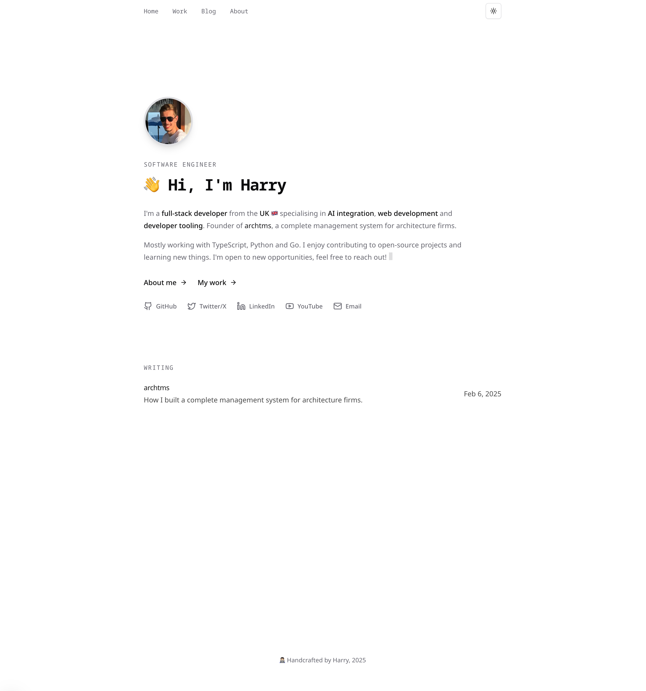

# Harry Baines | Personal Portfolio

<div align="center">
  
  <p><strong>Software Engineer | Full-Stack Developer | AI Enthusiast</strong></p>
</div>

## 📋 Overview

This is my personal portfolio website built with Next.js, showcasing my work experience, projects, and skills as a software engineer. The site features a modern, responsive design with smooth animations and a clean user interface.

### ✨ Live Demo

Visit the live site: [harry.dev](https://harry.dev)

## 🚀 Features

- **Responsive Design**: Fully responsive layout that works on all devices
- **Modern UI/UX**: Clean, professional design with smooth animations using Framer Motion
- **Dark/Light Mode**: Theme toggle for user preference
- **Performance Optimized**: Fast loading times with Next.js optimizations
- **SEO Friendly**: Proper metadata and semantic HTML
- **Content Sections**:
  - About Me: Professional background and personal interests
  - Work Experience: Timeline of professional roles
  - Projects: Showcase of personal and professional projects
  - GitHub Activity: Real-time GitHub contribution data
  - Blog: Technical articles and insights (if applicable)

## 🛠️ Technologies

- **Framework**: [Next.js 15](https://nextjs.org/)
- **Language**: [TypeScript](https://www.typescriptlang.org/)
- **Styling**: [Tailwind CSS](https://tailwindcss.com/)
- **UI Components**: shadcn components with [Radix UI](https://www.radix-ui.com/)
- **Animations**: [Framer Motion](https://www.framer.com/motion/)
- **Icons**: [Lucide React](https://lucide.dev/)
- **Fonts**: [Geist](https://vercel.com/font)
- **Analytics**: [Vercel Analytics](https://vercel.com/analytics)
- **Deployment**: [Vercel](https://vercel.com/)

## 🔧 Setup & Installation

1. **Clone the repository**

```bash
git clone https://github.com/harrybaines/harry.dev.git
cd harry.dev
```

2. **Install dependencies**

```bash
bun install
```

3. **Set up environment variables**

Create a `.env` file based on `.env.example`:

```bash
cp .env.example .env
```

4. **Run the development server**

```bash
bun dev
```

5. **Open [http://localhost:3000](http://localhost:3000) in your browser**

## 📦 Project Structure

```
harry.dev/
├── app/                # Next.js App Router
│   ├── about/          # About page
│   ├── blog/           # Blog section
│   ├── work/           # Work & projects page
│   ├── api/            # API routes
│   ├── layout.tsx      # Root layout
│   └── page.tsx        # Home page
├── components/         # Reusable UI components
├── content/            # Markdown/MDX content
├── data/               # Data files (projects, experience)
├── hooks/              # Custom React hooks
├── lib/                # Utility functions
└── public/             # Static assets
```

## 📬 Contact

Feel free to reach out if you have any questions or would like to connect:

- GitHub: [@harrybaines](https://github.com/harrybaines)
- Email: [harryb0905@googlemail.com](mailto:harryb0905@googlemail.com)

---

<div align="center">
  <p>Designed & Built by Harry Baines</p>
</div>
